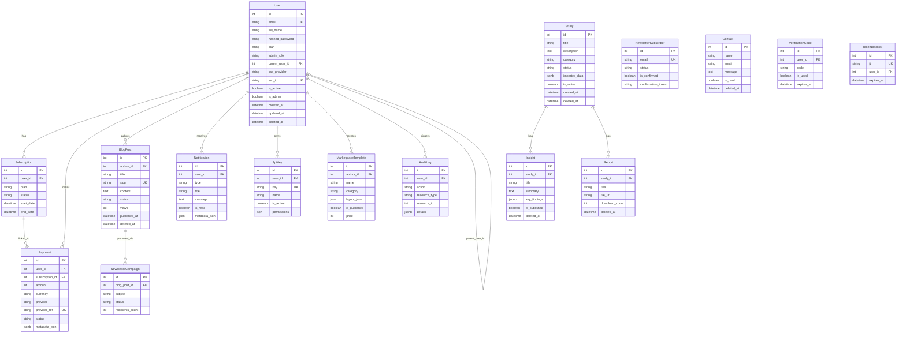

# Audit Base de Donnees — Afrikalytics API

**Date :** 15 mars 2026
**Auditeur :** Database Architect (Claude Code)
**Stack :** FastAPI 0.104 + SQLAlchemy 2.0 + PostgreSQL 16
**Fichiers audites :**
- `app/models.py` (535 lignes, 16 modeles SQLAlchemy)
- `app/database.py` (configuration moteur + sessions)
- `app/config.py` (pydantic-settings)
- `app/auth.py` (JWT + bcrypt)
- `app/schemas/` (18 fichiers Pydantic v2)
- `alembic/` (9 migrations)
- `app/routers/` (14 routers, requetes SQL)

---

## Score Global : 5.8 / 10

| Categorie | Score | Poids |
|-----------|-------|-------|
| Design du schema | 6/10 | 20% |
| Contraintes et integrite | 5/10 | 15% |
| Indexation | 7/10 | 15% |
| Securite des donnees | 5/10 | 15% |
| Gestion des sessions et connexions | 7/10 | 10% |
| Strategie de migration | 7/10 | 10% |
| Performance des requetes | 5/10 | 10% |
| Schemas Pydantic (validation) | 6/10 | 5% |

> **Progression notable** depuis le dernier audit (3.2/10) : Alembic est desormais en place, le connection pooling est configure, les indexes principaux existent, et le soft delete est implemente via mixin. Cependant, des problemes majeurs persistent au niveau de l'integrite des donnees, de la normalisation, et de la securite.

---

## Tableau Recapitulatif des Problemes

| # | Probleme | Criticite | Categorie | Impact |
|---|----------|-----------|-----------|--------|
| 1 | Valeurs `default=` au lieu de `server_default=` sur plusieurs colonnes | **Critique** | Integrite | Les valeurs par defaut ne sont pas appliquees en cas d'insertion directe SQL |
| 2 | Absence de `CheckConstraint` sur les champs status/plan/role | **Critique** | Integrite | Donnees invalides possibles en base |
| 3 | Cles primaires `Integer` au lieu de `BigInteger` | **Majeur** | Scalabilite | Limite a ~2.1 milliards de lignes par table |
| 4 | `imported_data` stocke en JSONB dans la table `studies` | **Majeur** | Design | Datasets volumineux dans une table transactionnelle, bloat |
| 5 | Absence de `ondelete` sur la majorite des foreign keys | **Majeur** | Integrite | Suppressions en cascade imprevisibles, orphelins possibles |
| 6 | Champ `type` sur `Notification` — mot reserve SQL | **Mineur** | Conventions | Risque de conflit SQL, necessite des guillemets |
| 7 | `lazy="dynamic"` sur les relationships `User` | **Majeur** | Performance | Deprecie en SQLAlchemy 2.0, incompatible avec async |
| 8 | Mutable default `default=["read"]` sur `ApiKey.permissions` | **Critique** | Bug | Partage de reference mutable entre instances |
| 9 | Mutable default `default=[]` sur `MarketplaceTemplate.tags` | **Critique** | Bug | Partage de reference mutable entre instances |
| 10 | Pas d'index sur `Insight.study_id` et `Report.study_id` | **Majeur** | Performance | Full table scan sur les jointures par etude |
| 11 | Pas d'index sur `VerificationCode.user_id` | **Majeur** | Performance | Recherche lente des codes par utilisateur |
| 12 | `deadline` et `duration` stockes en `String` au lieu de types temporels | **Mineur** | Design | Impossible de faire des calculs/comparaisons SQL |
| 13 | Pas de contrainte `CHECK` sur `Payment.amount > 0` | **Majeur** | Integrite | Montants negatifs ou nuls possibles |
| 14 | `BlogPost.increment_views()` fait un `commit()` dans le modele | **Majeur** | Architecture | Violation du principe de separation des responsabilites, transaction imprevisible |
| 15 | Pas de validation de `admin_role` dans le modele | **Majeur** | Securite | Roles arbitraires possibles en base |
| 16 | `sso_id` unique globalement au lieu de unique par provider | **Majeur** | Design | Collision possible entre providers SSO |
| 17 | Pas de relation `Study -> Insight` et `Study -> Report` | **Mineur** | Design | Pas de navigation ORM, jointures manuelles requises |
| 18 | Schemas Pydantic utilisent `@validator` (V1) au lieu de `@field_validator` (V2) | **Mineur** | Dette technique | Deprecation warnings, migration future couteuse |
| 19 | `PlanType` defini 3 fois dans les schemas (duplication) | **Mineur** | Conventions | Risque de desynchronisation |
| 20 | Pas de pagination sur certains endpoints (contacts, insights, reports, studies) | **Majeur** | Performance | Chargement de toutes les lignes en memoire |
| 21 | `Notification.metadata_json` utilise `JSON` au lieu de `JSONB` | **Mineur** | Performance | Pas d'index GIN possible, pas de fonctions JSONB |
| 22 | Absence de nettoyage automatique des `VerificationCode` et `TokenBlacklist` expires | **Majeur** | Operations | Croissance indefinie de tables techniques |

---

## Analyse Detaillee par Categorie

### 1. Design du Schema (6/10)

#### Points positifs
- Le `SoftDeleteMixin` est bien implemente avec `deleted_at` indexe.
- Les timestamps `created_at` / `updated_at` utilisent `func.now()` et `timezone=True`.
- Les longueurs de champs `String` sont coherentes (254 pour emails, 200 pour titres).
- Le modele `Payment` est bien structure avec separation provider/status.
- Les modeles `AuditLog`, `TokenBlacklist`, `ApiKey` et `Notification` sont de bons ajouts.

#### Problemes identifies

**P4 — `imported_data` en JSONB dans `studies` (Majeur)**

Stocker des datasets CSV/Excel complets en JSONB dans la table `studies` est problematique :
- Un dataset de 10 000 lignes peut peser plusieurs Mo, ralentissant les SELECT simples.
- Le TOAST de PostgreSQL gere les gros objets, mais chaque lecture de la ligne desserialise le JSONB.
- Pas de possibilite de requeter les donnees importees de maniere efficace.

```python
# ACTUEL — problematique
class Study(Base):
    imported_data = Column(JSONB, nullable=True)  # Dataset entier

# RECOMMANDE — table dediee
class StudyDataset(Base):
    __tablename__ = "study_datasets"
    id = Column(BigInteger, primary_key=True)
    study_id = Column(BigInteger, ForeignKey("studies.id", ondelete="CASCADE"), nullable=False, index=True)
    data = Column(JSONB, nullable=False)
    columns = Column(JSONB, nullable=False)
    row_count = Column(Integer, nullable=False)
    source_filename = Column(String(255), nullable=True)
    created_at = Column(DateTime(timezone=True), server_default=func.now())
```

**P12 — `deadline` et `duration` en String (Mineur)**

```python
# ACTUEL
deadline = Column(String(50), nullable=True)       # "31 mars 2026" ?
duration = Column(String(50), default="15-20 min")  # Non calculable

# RECOMMANDE
deadline = Column(DateTime(timezone=True), nullable=True)
estimated_duration_minutes = Column(Integer, nullable=True, server_default=text("15"))
```

**P16 — `sso_id` unique globalement (Majeur)**

Un utilisateur Google avec `sso_id="12345"` et un utilisateur Microsoft avec le meme `sso_id="12345"` ne pourraient pas coexister.

```python
# ACTUEL
sso_id = Column(String(255), nullable=True, unique=True)

# RECOMMANDE — contrainte unique composite
sso_id = Column(String(255), nullable=True)

__table_args__ = (
    UniqueConstraint('sso_provider', 'sso_id', name='uq_users_sso_provider_id'),
)
```

**P17 — Relations manquantes Study -> Insight/Report (Mineur)**

```python
# Ajouter dans Study :
insights = relationship("Insight", backref="study", lazy="selectin")
reports = relationship("Report", backref="study", lazy="selectin")
```

---

### 2. Contraintes et Integrite (5/10)

#### Points positifs
- `CheckConstraint` sur `Payment.status` et `BlogPost.status` et `NewsletterCampaign.status`.
- Index partiel unique sur `Subscription` (un seul abonnement actif par utilisateur).
- `nullable=False` correctement utilise sur les champs obligatoires.

#### Problemes identifies

**P1 — `default=` vs `server_default=` (Critique)**

Plusieurs colonnes utilisent `default=` de SQLAlchemy (Python-side) au lieu de `server_default=` (database-side). Cela signifie que les insertions directes en SQL (scripts de migration, import bulk, debug) n'auront pas de valeur par defaut.

```python
# COLONNES AFFECTEES :
Study.duration       = Column(String(50), default="15-20 min")        # Python-side seulement
Study.icon           = Column(String(50), default="users")            # Python-side seulement
Study.is_active      = Column(Boolean, default=True)                  # Python-side seulement
Subscription.status  = Column(String(50), default="active")           # Python-side seulement
Insight.is_published = Column(Boolean, default=False)                 # Python-side seulement
Report.report_type   = Column(String(50), default="premium")         # Python-side seulement
Report.download_count= Column(Integer, default=0)                    # Python-side seulement
Report.is_available  = Column(Boolean, default=True)                  # Python-side seulement
NewsletterSubscriber.status    = Column(String(50), default="active") # Python-side seulement
NewsletterSubscriber.source    = Column(String(100), default="blog_footer")
NewsletterSubscriber.is_confirmed = Column(Boolean, default=False)
NewsletterCampaign.status      = Column(String(20), default="draft")  # Python-side seulement
NewsletterCampaign.recipients_count = Column(Integer, default=0)
Contact.is_read      = Column(Boolean, default=False)                 # Python-side seulement
VerificationCode.is_used = Column(Boolean, default=False)
Notification.is_read = Column(Boolean, default=False)
ApiKey.is_active     = Column(Boolean, default=True)
ApiKey.permissions   = Column(JSON, default=["read"])                 # Double probleme !
MarketplaceTemplate.tags = Column(JSON, default=[])                  # Double probleme !
MarketplaceTemplate.is_published = Column(Boolean, default=False)
MarketplaceTemplate.is_free = Column(Boolean, default=True)
MarketplaceTemplate.price = Column(Integer, default=0)
MarketplaceTemplate.install_count = Column(Integer, default=0)
MarketplaceTemplate.rating = Column(Float, default=0.0)
MarketplaceTemplate.rating_count = Column(Integer, default=0)
MarketplaceTemplate.widget_count = Column(Integer, default=0)

# CORRECTION — Utiliser server_default partout :
is_active = Column(Boolean, nullable=False, server_default=text("true"))
status = Column(String(50), nullable=False, server_default=text("'active'"))
download_count = Column(Integer, nullable=False, server_default=text("0"))
```

**P2 — Absence de CheckConstraint sur status/plan/role (Critique)**

```python
# MANQUANT — Study.status
CheckConstraint(
    "status IN ('Ouvert', 'Ferme', 'Bientot')",
    name="ck_studies_status"
)

# MANQUANT — User.plan
CheckConstraint(
    "plan IN ('basic', 'professionnel', 'entreprise')",
    name="ck_users_plan"
)

# MANQUANT — User.admin_role
CheckConstraint(
    "admin_role IS NULL OR admin_role IN ('super_admin', 'admin_content', 'admin_studies', 'admin_insights', 'admin_reports')",
    name="ck_users_admin_role"
)

# MANQUANT — Subscription.status
CheckConstraint(
    "status IN ('active', 'cancelled', 'expired')",
    name="ck_subscriptions_status"
)

# MANQUANT — Report.report_type
CheckConstraint(
    "report_type IN ('basic', 'premium')",
    name="ck_reports_report_type"
)

# MANQUANT — NewsletterSubscriber.status
CheckConstraint(
    "status IN ('active', 'unsubscribed', 'bounced')",
    name="ck_newsletter_subscribers_status"
)
```

**P5 — Absence de `ondelete` sur les foreign keys (Majeur)**

```python
# COLONNES SANS ondelete :
User.parent_user_id    -> ForeignKey("users.id")           # Que faire si le parent est supprime ?
Subscription.user_id   -> ForeignKey("users.id")           # Orphelins si user supprime
Insight.study_id       -> ForeignKey("studies.id")         # Orphelins si study supprimee
Report.study_id        -> ForeignKey("studies.id")         # Orphelins si study supprimee
BlogPost.author_id     -> ForeignKey("users.id")           # Orphelins si user supprime
VerificationCode.user_id -> ForeignKey("users.id")         # Orphelins si user supprime
MarketplaceTemplate.author_id -> ForeignKey("users.id")    # Orphelins si user supprime

# RECOMMANDATIONS :
# Subscription.user_id  -> ondelete="CASCADE"   (supprimer avec l'utilisateur)
# Insight.study_id       -> ondelete="CASCADE"   (supprimer avec l'etude)
# Report.study_id        -> ondelete="CASCADE"   (supprimer avec l'etude)
# BlogPost.author_id     -> ondelete="SET NULL" + nullable=True  (conserver le post)
# VerificationCode.user_id -> ondelete="CASCADE" (supprimer avec l'utilisateur)
# User.parent_user_id   -> ondelete="SET NULL"   (garder le sous-utilisateur)
# MarketplaceTemplate.author_id -> ondelete="SET NULL" (garder le template)
```

**P13 — Pas de contrainte `CHECK` sur `Payment.amount` (Majeur)**

```python
# AJOUTER :
CheckConstraint("amount > 0", name="ck_payments_amount_positive")
```

---

### 3. Indexation (7/10)

#### Points positifs
- Index sur `User.email`, `BlogPost.slug`, `BlogPost.category`, `BlogPost.status`.
- Index composite sur `AuditLog` (user_id, action, created_at).
- Index composite sur `Notification` (user_id, is_read, created_at).
- Index partiel unique sur `Subscription` (un actif par user).
- `TokenBlacklist.jti` et `TokenBlacklist.expires_at` indexes.
- `SoftDeleteMixin.deleted_at` indexe.

#### Index manquants (P10, P11)

```python
# MANQUANT — Recherche d'insights par etude (jointure tres frequente)
Index("ix_insights_study_id", Insight.study_id)

# MANQUANT — Recherche de reports par etude
Index("ix_reports_study_id", Report.study_id)

# MANQUANT — Recherche de codes de verification par utilisateur
Index("ix_verification_codes_user_id", VerificationCode.user_id)

# MANQUANT — Recherche de codes non utilises et non expires
Index(
    "ix_verification_codes_user_active",
    VerificationCode.user_id,
    VerificationCode.is_used,
    VerificationCode.expires_at,
)

# MANQUANT — Filtre soft-delete + actif sur etudes
Index(
    "ix_studies_active",
    Study.is_active,
    Study.deleted_at,
)

# RECOMMANDE — Index partiel pour newsletter subscribers confirmes actifs
Index(
    "ix_newsletter_confirmed_active",
    NewsletterSubscriber.id,
    postgresql_where=text("is_confirmed = true AND status = 'active'"),
)

# RECOMMANDE — Index sur Payment.created_at pour historique
Index("ix_payments_created_at", Payment.created_at)
```

#### Index existants potentiellement inutiles

Les `index=True` sur les colonnes `id` (primary key) sont redondants — PostgreSQL cree automatiquement un index B-tree sur les cles primaires. Ce n'est pas nuisible mais c'est du bruit dans le code.

---

### 4. Securite des Donnees (5/10)

#### Points positifs
- Mots de passe hashes avec `bcrypt` + salt automatique.
- JWT utilise les variables d'environnement via `pydantic-settings` (plus de fallback en dur).
- Token blacklist implementee pour la revocation.
- Audit log en place pour la tracabilite.
- `send_default_pii=False` sur Sentry (RGPD).

#### Problemes identifies

**P15 — Pas de validation de `admin_role` dans le modele (Majeur)**

Le champ `admin_role` accepte n'importe quelle chaine. Un attaquant qui obtient un acces en ecriture a la base pourrait s'attribuer un role arbitraire. La contrainte doit etre au niveau base de donnees.

```python
# Voir P2 pour la contrainte CHECK recommandee
```

**Risque de fuite de donnees sensibles via les schemas**

Le schema `UserResponse` dans `auth.py` expose `parent_user_id` et `admin_role` a tous les utilisateurs authentifies. Ces champs devraient etre reserves aux reponses admin.

```python
# RECOMMANDE — Schema restreint pour les utilisateurs normaux
class UserPublicResponse(BaseModel):
    id: int
    email: str
    full_name: str
    plan: str
    is_active: bool
    created_at: datetime

    model_config = ConfigDict(from_attributes=True)
```

**Tokens de confirmation newsletter en clair**

Les `confirmation_token` et `unsubscribe_token` sont stockes en clair. Si la base est compromise, un attaquant peut confirmer/desabonner n'importe quel email. Ces tokens devraient etre hashes (comme les mots de passe).

**Cles API stockees en clair**

Le champ `ApiKey.key` stocke la cle API en clair. Bonne pratique : stocker uniquement le hash et montrer la cle complete une seule fois a la creation.

```python
# RECOMMANDE
class ApiKey(Base):
    key_hash = Column(String(64), unique=True, nullable=False, index=True)
    key_prefix = Column(String(8), nullable=False)  # "ak_xxxx" pour identification
```

---

### 5. Gestion des Sessions et Connexions (7/10)

#### Points positifs
- Connection pooling configure : `pool_size=5`, `max_overflow=10`, `pool_pre_ping=True`.
- `pool_recycle=300` pour eviter les connexions mortes (important sur Railway).
- `connect_timeout=10` pour eviter les blocages.
- Session `get_db()` avec gestion propre du rollback et close dans un generateur.
- Architecture tenant (RLS) commencee avec `get_tenant_db()`.

#### Points d'amelioration

**Pool size pour la production**

Avec `pool_size=5` et `max_overflow=10`, le maximum est de 15 connexions simultanees. Pour un SaaS avec des pics de trafic, cela peut etre insuffisant. Railway PostgreSQL supporte generalement 20-100 connexions selon le plan.

```python
# RECOMMANDE — Adapter selon le plan Railway
engine = create_engine(
    DATABASE_URL,
    pool_size=10,                # 10 connexions permanentes
    max_overflow=20,             # 20 connexions supplementaires en pic
    pool_pre_ping=True,
    pool_recycle=300,
    pool_timeout=30,             # Timeout d'attente d'une connexion libre
    connect_args={"connect_timeout": 10},
    echo=settings.environment == "development",  # SQL logging en dev
)
```

**Pas de health check base de donnees**

L'endpoint `/health` ne verifie pas la connectivite a la base de donnees.

```python
@app.get("/health")
def health_check(db: Session = Depends(get_db)):
    try:
        db.execute(text("SELECT 1"))
        return {"status": "healthy", "database": "connected", "timestamp": datetime.now(timezone.utc)}
    except Exception:
        return JSONResponse(status_code=503, content={"status": "unhealthy", "database": "disconnected"})
```

---

### 6. Strategie de Migration (7/10)

#### Points positifs (progression majeure)
- Alembic est desormais installe et configure.
- 9 migrations existent, couvrant : schema initial, indexes/contraintes, JSONB, soft delete, payment, RLS, import, notifications/SSO.
- Le commentaire dans `main.py` indique correctement `alembic upgrade head`.
- `Base.metadata.create_all()` a ete retire de `main.py`.

#### Points d'amelioration

**Nommage des migrations**

Le mix de formats (`002_add_indexes...`, `2026_03_14_001_initial_schema`, `008_add_notification...`) rend l'ordre difficile a suivre. Standardiser sur un format date-based.

```
# RECOMMANDE :
YYYY_MM_DD_NNN_description.py
# Exemple :
2026_03_14_001_initial_schema.py
2026_03_14_002_add_indexes_constraints.py
2026_03_15_001_add_payment_table.py
```

**Pas de migration de donnees (data migration)**

Les migrations actuelles sont des DDL (schema) mais pas de migration de donnees. Quand les defaults changeront, il faudra des scripts pour migrer les lignes existantes.

**Pas de tests de migration**

Aucun test ne verifie que les migrations upgrade/downgrade fonctionnent correctement. Un downgrade casse pourrait bloquer un rollback en production.

---

### 7. Performance des Requetes (5/10)

#### Points positifs
- Utilisation de `joinedload` dans le router blog (evite N+1 sur author).
- Pagination implementee sur admin users et audit logs.
- Requetes SQLAlchemy 2.0 style (`select()` au lieu de `.query`).

#### Problemes identifies

**P7 — `lazy="dynamic"` deprecie (Majeur)**

```python
# ACTUEL — User model
subscriptions = relationship("Subscription", back_populates="user", lazy="dynamic")
blog_posts = relationship("BlogPost", back_populates="author", lazy="dynamic")
notifications = relationship("Notification", back_populates="user", lazy="dynamic")
api_keys = relationship("ApiKey", back_populates="user", lazy="dynamic")

# PROBLEME :
# - lazy="dynamic" est deprecie depuis SQLAlchemy 2.0
# - Incompatible avec les sessions async
# - Retourne un Query object au lieu d'une liste

# RECOMMANDE :
subscriptions = relationship("Subscription", back_populates="user", lazy="selectin")
blog_posts = relationship("BlogPost", back_populates="author", lazy="selectin")
notifications = relationship("Notification", back_populates="user", lazy="selectin")
api_keys = relationship("ApiKey", back_populates="user", lazy="selectin")
# Ou lazy="raise" pour forcer le eager loading explicite dans les requetes
```

**P14 — `commit()` dans le modele BlogPost (Majeur)**

```python
# ACTUEL — dans models.py
def increment_views(self, db):
    db.execute(
        update(BlogPost)
        .where(BlogPost.id == self.id)
        .values(views=BlogPost.views + 1)
    )
    db.commit()  # PROBLEME : commit dans le modele

# RECOMMANDE — dans le router ou un service
async def increment_views(db: Session, post_id: int):
    db.execute(
        update(BlogPost)
        .where(BlogPost.id == post_id)
        .values(views=BlogPost.views + 1)
    )
    # Le commit est gere par le caller ou le middleware
```

**P20 — Pas de pagination sur certains endpoints (Majeur)**

Les routers `contacts`, `insights`, `reports`, `studies` chargent toutes les lignes avec `.scalars().all()` sans pagination. Avec la croissance des donnees, cela va causer des timeouts et une consommation memoire excessive.

```python
# ACTUEL (studies router) :
studies = db.execute(
    select(Study).where(Study.deleted_at.is_(None))
).scalars().all()  # TOUTES les etudes

# RECOMMANDE :
@router.get("/")
def list_studies(
    skip: int = Query(0, ge=0),
    limit: int = Query(50, ge=1, le=100),
    db: Session = Depends(get_db),
):
    stmt = select(Study).where(Study.deleted_at.is_(None)).offset(skip).limit(limit)
    studies = db.execute(stmt).scalars().all()
    total = db.execute(select(func.count(Study.id)).where(Study.deleted_at.is_(None))).scalar()
    return {"items": studies, "total": total}
```

**Risque N+1 sur Insights et Reports**

Les routers `insights` et `reports` ne font pas de `joinedload` sur la relation `study`. Si le frontend affiche le nom de l'etude associee, chaque insight/report declenchera une requete supplementaire.

---

### 8. Schemas Pydantic — Validation (6/10)

#### Points positifs
- `EmailStr` utilise pour la validation des emails.
- `Field(max_length=...)` applique sur la plupart des champs texte.
- `ConfigDict(from_attributes=True)` (Pydantic v2) utilise sur les schemas recents.

#### Problemes identifies

**P18 — Utilisation de `@validator` (V1) au lieu de `@field_validator` (V2) (Mineur)**

Les schemas `blog.py` utilisent encore l'ancienne syntaxe Pydantic V1.

```python
# ACTUEL (blog.py)
@validator('status')
def validate_status(cls, v):
    ...

# RECOMMANDE (Pydantic V2)
from pydantic import field_validator

@field_validator('status')
@classmethod
def validate_status(cls, v: str) -> str:
    ...
```

**P19 — `PlanType` duplique 3 fois (Mineur)**

`PlanType = Literal["basic", "professionnel", "entreprise"]` est defini dans :
- `app/schemas/users.py`
- `app/schemas/payments.py`
- `app/schemas/admin.py`

```python
# RECOMMANDE — Un seul endroit
# app/schemas/common.py
from typing import Literal

PlanType = Literal["basic", "professionnel", "entreprise"]
AdminRoleType = Literal["super_admin", "admin_content", "admin_studies", "admin_insights", "admin_reports"]
SubscriptionStatusType = Literal["active", "cancelled", "expired"]
```

**Validation de mot de passe insuffisante**

Le schema `UserRegister` accepte un mot de passe de 1 caractere (pas de `min_length`).

```python
# ACTUEL
password: str = Field(..., max_length=128)

# RECOMMANDE
password: str = Field(..., min_length=8, max_length=128)
# Idealement avec une validation regex pour exiger majuscule, chiffre, etc.
```

**Pas de validation des URLs**

Les champs `embed_url_*`, `report_url_*`, `file_url`, `featured_image` acceptent n'importe quelle chaine. Utiliser `HttpUrl` de Pydantic.

---

### 9. Bugs Critiques

**P8 et P9 — Mutable Default Arguments (Critique)**

C'est un bug Python classique et dangereux. Les listes/dicts utilises comme valeurs par defaut dans les definitions de colonnes sont partages entre toutes les instances.

```python
# ACTUEL — BUG
class ApiKey(Base):
    permissions = Column(JSON, default=["read"])  # MUTABLE ! Partage entre instances

class MarketplaceTemplate(Base):
    tags = Column(JSON, default=[])  # MUTABLE ! Partage entre instances

# CORRECTION IMMEDIATE
class ApiKey(Base):
    permissions = Column(JSON, server_default=text("'[\"read\"]'::json"))

class MarketplaceTemplate(Base):
    tags = Column(JSON, server_default=text("'[]'::json"))
```

---

### 10. Nettoyage et Maintenance (P22)

**Absence de nettoyage des tables techniques (Majeur)**

Les tables `verification_codes` et `token_blacklist` vont croitre indefiniment car les lignes expirees ne sont jamais supprimees.

```python
# RECOMMANDE — Tache CRON ou endpoint admin
from sqlalchemy import delete

def cleanup_expired_tokens(db: Session):
    """Supprimer les tokens et codes expires."""
    now = datetime.now(timezone.utc)
    db.execute(delete(TokenBlacklist).where(TokenBlacklist.expires_at < now))
    db.execute(delete(VerificationCode).where(VerificationCode.expires_at < now))
    db.commit()

# Alternative PostgreSQL native :
# CREATE EXTENSION pg_cron;
# SELECT cron.schedule('cleanup-tokens', '0 3 * * *',
#   $$DELETE FROM token_blacklist WHERE expires_at < NOW()$$);
```

---

## Recommandations Prioritaires

### Phase 1 — Corrections critiques (Semaine 1)

| # | Action | Effort | Migration Alembic |
|---|--------|--------|-------------------|
| P8/P9 | Corriger les mutable defaults (`ApiKey.permissions`, `MarketplaceTemplate.tags`) | 30 min | Oui (server_default) |
| P1 | Migrer tous les `default=` vers `server_default=` | 2h | Oui |
| P2 | Ajouter les `CheckConstraint` sur plan, status, admin_role | 2h | Oui |
| P5 | Ajouter `ondelete` sur toutes les foreign keys | 1h | Oui |
| P13 | Ajouter `CHECK amount > 0` sur Payment | 15 min | Oui |

### Phase 2 — Performance et securite (Semaine 2)

| # | Action | Effort | Migration Alembic |
|---|--------|--------|-------------------|
| P10/P11 | Ajouter les index manquants (study_id, user_id) | 1h | Oui |
| P7 | Migrer `lazy="dynamic"` vers `lazy="selectin"` | 30 min | Non (code only) |
| P14 | Extraire `increment_views()` du modele | 30 min | Non (code only) |
| P20 | Ajouter la pagination sur tous les endpoints de listing | 3h | Non (code only) |
| P22 | Implementer le nettoyage des tokens/codes expires | 2h | Non (code + cron) |

### Phase 3 — Design et dette technique (Semaines 3-4)

| # | Action | Effort | Migration Alembic |
|---|--------|--------|-------------------|
| P3 | Migrer les PK de `Integer` vers `BigInteger` | 4h | Oui (attention perf) |
| P16 | Corriger l'unicite `sso_id` par provider | 1h | Oui |
| P4 | Extraire `imported_data` dans une table dediee `study_datasets` | 4h | Oui (data migration) |
| P18 | Migrer `@validator` vers `@field_validator` | 1h | Non (code only) |
| P19 | Centraliser `PlanType` et les enums partages | 30 min | Non (code only) |
| P17 | Ajouter les relations Study -> Insight/Report | 30 min | Non (code only) |
| P21 | Migrer `Notification.metadata_json` de JSON vers JSONB | 30 min | Oui |
| P6 | Renommer `Notification.type` en `notification_type` | 1h | Oui |

### Phase 4 — Hardening (Mois 2)

| Action | Effort |
|--------|--------|
| Hasher les tokens de confirmation newsletter | 2h |
| Hasher les cles API (stocker uniquement le hash) | 3h |
| Ajouter des tests de migration (upgrade + downgrade) | 4h |
| Implementer le health check DB sur `/health` | 30 min |
| Ajouter des schemas Pydantic distincts pour admin vs user | 2h |
| Partitionner `audit_logs` par mois (range partitioning sur `created_at`) | 4h |
| Ajouter la validation de mot de passe forte (min 8 chars, complexite) | 1h |

---

## Migration Alembic Exemple — Phase 1

```python
"""Fix critical: server_defaults, check constraints, ondelete, mutable defaults.

Revision ID: 009_fix_critical_integrity
"""
from alembic import op
import sqlalchemy as sa

def upgrade():
    # --- P8/P9: Fix mutable defaults ---
    op.alter_column('api_keys', 'permissions',
        server_default=sa.text("'[\"read\"]'::json"))
    op.alter_column('marketplace_templates', 'tags',
        server_default=sa.text("'[]'::json"))

    # --- P1: Add server_defaults where missing ---
    op.alter_column('studies', 'is_active',
        server_default=sa.text("true"), nullable=False)
    op.alter_column('studies', 'status',
        server_default=sa.text("'Ouvert'"))
    op.alter_column('subscriptions', 'status',
        server_default=sa.text("'active'"))
    op.alter_column('insights', 'is_published',
        server_default=sa.text("false"), nullable=False)
    op.alter_column('reports', 'report_type',
        server_default=sa.text("'premium'"))
    op.alter_column('reports', 'download_count',
        server_default=sa.text("0"), nullable=False)
    op.alter_column('reports', 'is_available',
        server_default=sa.text("true"), nullable=False)
    op.alter_column('newsletter_subscribers', 'status',
        server_default=sa.text("'active'"))
    op.alter_column('newsletter_subscribers', 'is_confirmed',
        server_default=sa.text("false"), nullable=False)
    op.alter_column('contacts', 'is_read',
        server_default=sa.text("false"), nullable=False)
    op.alter_column('verification_codes', 'is_used',
        server_default=sa.text("false"), nullable=False)
    op.alter_column('notifications', 'is_read',
        server_default=sa.text("false"), nullable=False)
    op.alter_column('api_keys', 'is_active',
        server_default=sa.text("true"), nullable=False)
    op.alter_column('marketplace_templates', 'is_published',
        server_default=sa.text("false"))
    op.alter_column('marketplace_templates', 'is_free',
        server_default=sa.text("true"))
    op.alter_column('marketplace_templates', 'price',
        server_default=sa.text("0"))
    op.alter_column('marketplace_templates', 'install_count',
        server_default=sa.text("0"))
    op.alter_column('marketplace_templates', 'rating',
        server_default=sa.text("0.0"))
    op.alter_column('marketplace_templates', 'rating_count',
        server_default=sa.text("0"))
    op.alter_column('marketplace_templates', 'widget_count',
        server_default=sa.text("0"))

    # --- P2: Check constraints ---
    op.create_check_constraint('ck_users_plan', 'users',
        "plan IN ('basic', 'professionnel', 'entreprise')")
    op.create_check_constraint('ck_users_admin_role', 'users',
        "admin_role IS NULL OR admin_role IN ('super_admin', 'admin_content', 'admin_studies', 'admin_insights', 'admin_reports')")
    op.create_check_constraint('ck_studies_status', 'studies',
        "status IN ('Ouvert', 'Ferme', 'Bientot')")
    op.create_check_constraint('ck_subscriptions_status', 'subscriptions',
        "status IN ('active', 'cancelled', 'expired')")
    op.create_check_constraint('ck_reports_report_type', 'reports',
        "report_type IN ('basic', 'premium')")
    op.create_check_constraint('ck_newsletter_subscribers_status', 'newsletter_subscribers',
        "status IN ('active', 'unsubscribed', 'bounced')")

    # --- P13: Amount positive ---
    op.create_check_constraint('ck_payments_amount_positive', 'payments',
        "amount > 0")

    # --- P10/P11: Missing indexes ---
    op.create_index('ix_insights_study_id', 'insights', ['study_id'])
    op.create_index('ix_reports_study_id', 'reports', ['study_id'])
    op.create_index('ix_verification_codes_user_id', 'verification_codes', ['user_id'])


def downgrade():
    op.drop_index('ix_verification_codes_user_id')
    op.drop_index('ix_reports_study_id')
    op.drop_index('ix_insights_study_id')

    op.drop_constraint('ck_payments_amount_positive', 'payments')
    op.drop_constraint('ck_newsletter_subscribers_status', 'newsletter_subscribers')
    op.drop_constraint('ck_reports_report_type', 'reports')
    op.drop_constraint('ck_subscriptions_status', 'subscriptions')
    op.drop_constraint('ck_studies_status', 'studies')
    op.drop_constraint('ck_users_admin_role', 'users')
    op.drop_constraint('ck_users_plan', 'users')

    # Note: server_default removals omitted for brevity
```

---

## Diagramme Relationnel Actuel (Mermaid)



---

## Conclusion

Le score est passe de **3.2/10** a **5.8/10** grace aux efforts de refactoring (Alembic, connection pooling, modularisation, audit log, token blacklist). Cependant, les **problemes d'integrite des donnees** (absence de contraintes CHECK, defaults Python-side, foreign keys sans ondelete) et les **bugs de mutable defaults** representent des risques critiques en production.

Les corrections de Phase 1 (1-2 jours de travail) corrigeraient les problemes les plus urgents et feraient passer le score au-dessus de **7/10**. La Phase 2 (performance + pagination) est necessaire avant tout pic de trafic ou croissance significative des donnees.

**Effort total estime :** ~40 heures sur 4 semaines pour atteindre un score de **8.5/10**.
